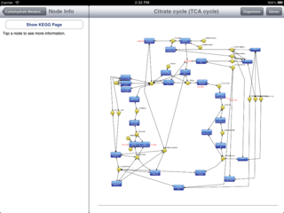
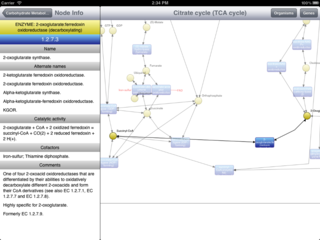

Welcome to PathCase KEGG for iPad. Using this application, you can view
metabolic pathways from [KEGG] stored in the PathCase database. Additional
information about reactions is proved by the [ENZYME] enzyme nomenclature
database.

[KEGG]: http://www.kegg.com/
[ENZYME]: http://enzyme.expasy.org/

## Browsing Pathways

If you are holding your iPad in landscape mode, the list of pathways is in the
sidebar on the left side of the screen. If you are holding it in portrait mode,
you can press the button in the upper left corner to see the sidebar.

Tap a category to see the pathways within it. In this list of pathways, **bold**
items have *frozen layouts*, with nodes and edges arranged by hand. Non-bold
items have automatically generated layouts which may be more difficult to work
with.

## Interacting with Pathway Visualizations

Once you select a pathway from the list, you will see a graph much like this
one:

You can use standard one- and two-finger gestures to pan and zoom around this
graph. Press the **Show KEGG Page** button to display the pathway's page on the
KEGG web site:

<!-- sometimes vim's syntax highlighting is not so good -->

**Tap any node** to select it. That node and its immediate neighbors will be
highlighted on the graph, and more information about it will appear in the
sidebar. (Remember that if you are holding your iPad in portrait mode, you can
use the button in the upper left to access the sidebar.)

If the node is a reaction and PathCase has an EC number stored for it, extra
information from the [ENZYME] database is shown.

**Double-tap a node** to zoom the view to contain that node and its immediate
neighbors.

**Press and hold** on a node to drag it around the screen. You can use this
feature if the visualization is cluttered or otherwise difficult to read.
Unfortunately, the positions you set are *not* saved when you leave the
visualization for a pathway.
